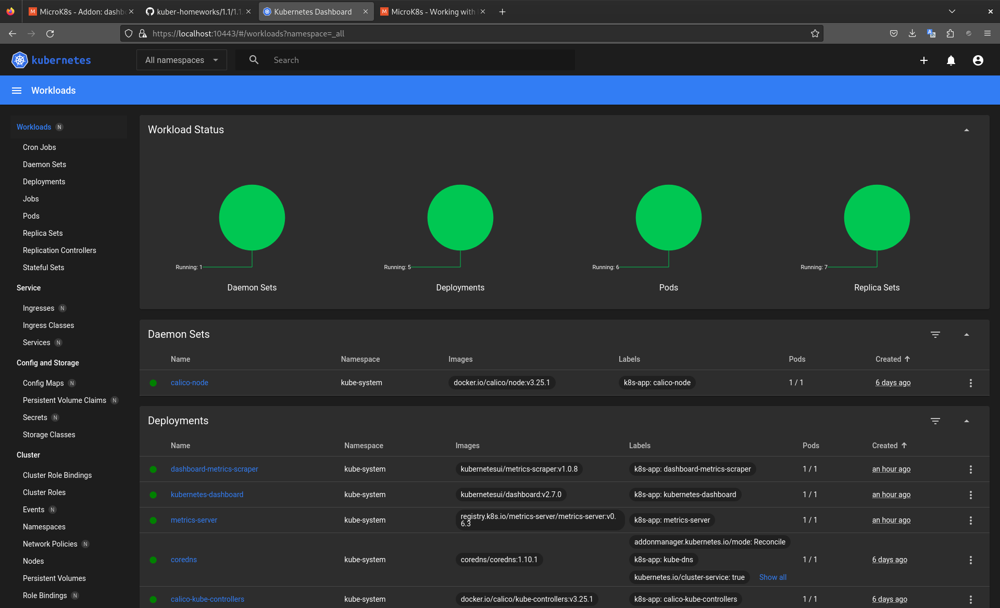

# Домашнее задание к занятию «Kubernetes. Причины появления. Команда kubectl»

## <b>Выполнение</b>

<br>

1. Результат выполнения команды `kubectl get nodes`
```
ditry@study:~/.kube$ kubectl get nodes
NAME    STATUS   ROLES    AGE     VERSION
study   Ready    <none>   6d11h   v1.28.4
```  
  
<br>

2. Скриншот дашборда установленного кластера microk8s

